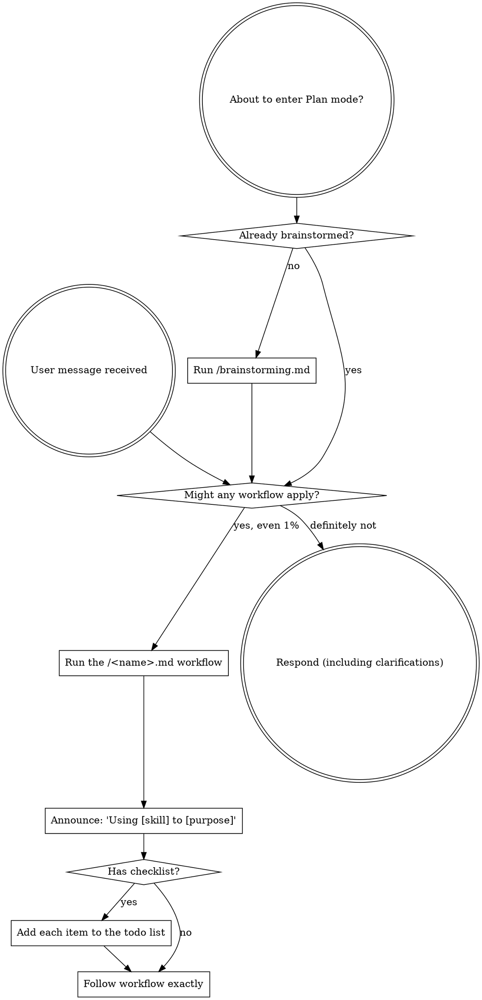

<EXTREMELY-IMPORTANT>
You have superpowers.

This file is your introduction to using **skills**. In Cline, skills are shipped as **workflows** — Markdown files in `.clinerules/workflows/`, invoked on demand with a slash command like `/brainstorming.md`.

If you think there is even a 1% chance a skill might apply to what you are doing, you ABSOLUTELY MUST invoke the workflow.

IF A SKILL APPLIES TO YOUR TASK, YOU DO NOT HAVE A CHOICE. YOU MUST USE IT.

This is not negotiable. This is not optional. You cannot rationalize your way out of this.
</EXTREMELY-IMPORTANT>

<SUBTASK-STOP>
If you are running inside a Cline subtask that was spawned to execute one specific step, skip this bootstrap — your parent task already applied the relevant workflow.
</SUBTASK-STOP>

## Instruction Priority

Superpowers workflows override default behavior, but **user instructions always take precedence**:

1. **User's explicit instructions** (`.clinerules/` project rules, direct requests) — highest priority
2. **Superpowers workflows** — override default behavior where they conflict
3. **Default behavior** — lowest priority

If a project rule says "don't use TDD" and a workflow says "always use TDD," follow the project rule. The user is in control.

## How to Access Skills (Cline)

Every skill in this library is a workflow at `.clinerules/workflows/<name>.md`. To use one, **run it as a slash command**: type `/<name>.md` in chat (e.g. `/brainstorming.md`, `/systematic-debugging.md`). Cline injects that workflow's content into the conversation; follow it directly.

The available workflows (skills):

- `/brainstorming.md` — turn an idea into a design before any creative work
- `/writing-plans.md` — turn a spec into a step-by-step implementation plan
- `/executing-plans.md` — execute a written plan with review checkpoints
- `/subagent-driven-development.md` — execute plan tasks via isolated Cline subtasks
- `/dispatching-parallel-agents.md` — split independent work across isolated subtasks
- `/test-driven-development.md` — RED-GREEN-REFACTOR discipline for any feature or fix
- `/systematic-debugging.md` — root-cause a bug before proposing fixes
- `/requesting-code-review.md` — get a fresh-context review of completed work
- `/receiving-code-review.md` — process review feedback with technical rigor
- `/verification-before-completion.md` — prove work is done before claiming it
- `/using-git-worktrees.md` — isolated workspace before feature work
- `/finishing-a-development-branch.md` — merge / PR / cleanup decision after work is done
- `/writing-skills.md` — author or edit a workflow (skill) itself
- `/ultrathink.md` — force a deep, written, multi-phase reasoning pass on a hard task before acting (Cline addition, not from upstream superpowers)

When any workflow says "invoke the X skill", "use the X skill", or "REQUIRED SUB-SKILL: X", that means **run the `/X.md` workflow**. Workflow text sometimes uses Claude Code tool names (`Skill`, `Task`, `TodoWrite`); see `.clinerules/cline-tools.md` for Cline equivalents.

## The Rule

**Invoke relevant or requested workflows BEFORE any response or action.** Even a 1% chance a workflow might apply means you should run it to check. If it turns out to be wrong for the situation, you don't need to use it.

## Red Flags

These thoughts mean STOP—you're rationalizing:

| Thought | Reality |
|---------|---------|
| "This is just a simple question" | Questions are tasks. Check for a workflow. |
| "I need more context first" | Workflow check comes BEFORE clarifying questions. |
| "Let me explore the codebase first" | Workflows tell you HOW to explore. Check first. |
| "I can check git/files quickly" | Files lack conversation context. Check for a workflow. |
| "Let me gather information first" | Workflows tell you HOW to gather information. |
| "This doesn't need a formal workflow" | If a workflow exists, use it. |
| "I remember this workflow" | Workflows evolve. Read the current version. |
| "This doesn't count as a task" | Action = task. Check for a workflow. |
| "The workflow is overkill" | Simple things become complex. Use it. |
| "I'll just do this one thing first" | Check BEFORE doing anything. |
| "This feels productive" | Undisciplined action wastes time. Workflows prevent this. |
| "I know what that means" | Knowing the concept ≠ using the workflow. Run it. |

## Skill Priority

When multiple workflows could apply, use this order:

1. **Process workflows first** (`/brainstorming.md`, `/systematic-debugging.md`) — these determine HOW to approach the task
2. **Implementation workflows second** — these guide execution

"Let's build X" → `/brainstorming.md` first, then implementation.
"Fix this bug" → `/systematic-debugging.md` first, then domain-specific work.

## Skill Types

**Rigid** (TDD, debugging): Follow exactly. Don't adapt away the discipline.

**Flexible** (patterns): Adapt principles to context.

The workflow itself tells you which.

## User Instructions

Instructions say WHAT, not HOW. "Add X" or "Fix Y" doesn't mean skip workflows.
